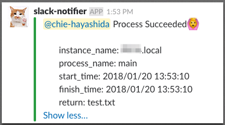
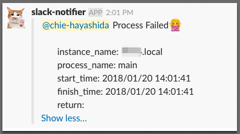
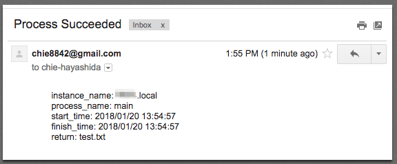
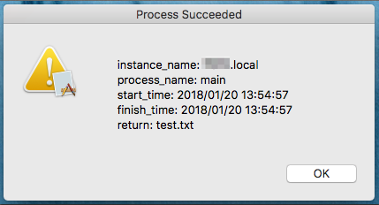

# easy_notifier


truly easily notify your process information when it finished

## Description

* Easy_notifier is a decorator that supports time-consuming, trial-and-error integrations.
* It can tell the start time, finish time, status, and return value when your process finished.
* It can tell your process end with slack, e-mail, or mac pop-up.
* Usage is very easy. only write `@easy_notifier` on your method.

Japanese document is [here](http://chie8842.hatenablog.com/entry/2018/01/21/152626).

## Installation

`pip install easy_notifier` or build from source.

```
git clone https://github.com/chie8842/easy_notifier
cd easy_notifier
pip install . -r requirements.txt
```

## Usage

Only three steps to use easy-notifier.

1. put config.ini at your current directory
2. write `@easy_notifier` on the method at your python script
3. execute your python script

```
@easy_notifier
def example_func()
   ...
   ...

```

You can use another file name with args as below.

```
@easy_notifier(~/.easy_notifier.cfg)
def example_func()
   ...
   ...

```

## Configurations

Put configuration file and set according to [config.ini.sample](https://github.com/chie8842/easy_notifier/blob/master/easy_notifier/config.ini.sample) 

Explaination for each parameter is below.

* env  
you can set ec2 or gce or local.
If you set ec2, `Name` tag is used for instance_name at notification.
Else if you set local, `hostname` is used for instance_name at notification.
gce is not integrated now. 

* process_name  
You can set any string which explain your process.
If you don't set this parameter, `func.__name__` will used as the process_name.

* notify_slack  
Notify slack when this parameter is true/yes.

* notify_mac  
Notify mac pop-up when this parameter is true/yes.
This parameter is ignored on Linux and Windows.

* notify_gmail  
Notify from your gmail address to any other email address.
It is needed to go to this link and select Turn On when you first use with your gmail account.  
https://www.google.com/settings/security/lesssecureapps

* incoming_webhook  
Set your incoming webhook of Slack here whe you set notify_slack on.

* slack_id  
Specify slack_id to mention when you set notify_slack on.

* channel  
Set the channel for notification when you set notify_slack on.

* from_address  
Set your gmail address when you set notify_gmail on.

* from_password  
Set your gmail password when you set notify_gmail on.

* to_address  
Set any email address to notify when you set notify_gmail on

Here is example of config file.

```
[easy_notifier]
env = ec2
incomming_webhook_url = https://hooks.slack.com/services/aaa/bbb
slack_id = chie-hayashida
process_name = test
channel = chie_test
```

## Notification Result Sample




